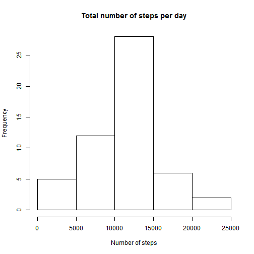
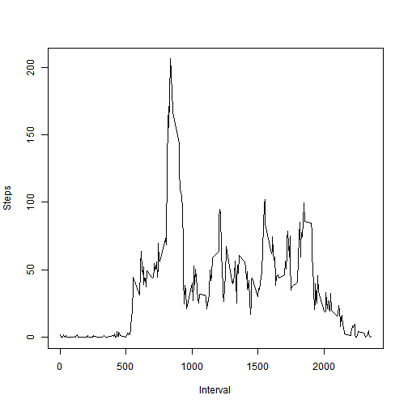

```r
install.packages("dplyr")
```

```
## Installing package into 'C:/Users/221031759/Documents/R/win-library/3.1'
## (as 'lib' is unspecified)
```

```
## Warning: package 'dplyr' is in use and will not be installed
```

```r
library(dplyr)
library(ggplot2)

## Loading and preprocessing the data

activity_dt <- read.csv("activity.csv")
activity_dt$day_type <- weekdays(as.Date(activity_dt$date, format="%Y-%m-%d"))
total_steps  <- sum(activity_dt$steps, na.rm=TRUE)
hist(activity_dt$steps,main="Total Steps Taken Per Day", xlab="Days", ylab="Steps")
```

 

## What is mean total number of steps taken per day?

```r
summarize(activity_dt, mean(steps, na.rm=TRUE))
```

```
##   mean(steps, na.rm = TRUE)
## 1                   37.3826
```

```r
summarize(activity_dt, median(steps, na.rm=TRUE))
```

```
##   median(steps, na.rm = TRUE)
## 1                           0
```
## What is the average daily activity pattern?

```r
plot(activity_dt$interval, activity_dt$steps, type="l", xlab="Interval", ylab="Steps")
```

 

## Imputing missing values

```r
sum(is.na(activity_dt$steps))
```

```
## [1] 2304
```

```r
activity_dt_blank <- activity_dt[is.na(activity_dt$steps),]
activity_dt_non_blank <- activity_dt[!is.na(activity_dt$steps),]

by_interval <- group_by(activity_dt, interval)
mean_steps_per_interval <- summarize(by_interval,mean(steps, na.rm=TRUE))

activity_dt_blank <- merge(activity_dt_blank, mean_steps_per_interval, by.x="interval",by.y="interval")
activity_dt_blank$steps <- NULL
names(activity_dt_blank)[4] <- paste("steps")

activity_tidy_dt <- data.frame(activity_dt_non_blank$interval,activity_dt_non_blank$date,activity_dt_non_blank$day_type,activity_dt_non_blank$steps)
names(activity_tidy_dt) <- names(activity_dt_blank)
activity_tidy_dt <- rbind(activity_tidy_dt,activity_dt_blank)
hist(activity_tidy_dt$steps, main = "Total steps taken per day", xlab = "Days", ylab="Steps")
```

 

```r
by_day <- group_by(activity_tidy_dt, date)
mean_median_daily <- summarize(by_day, mean_steps = mean(steps), median_steps = median(steps))
total_steps  <- sum(activity_tidy_dt$steps)
```
## Are there differences in activity patterns between weekdays and weekends?

```r
activity_tidy_dt$day_type <- ifelse(activity_tidy_dt$day_type %in% c("Saturday","Sunday"),"weekend","weekday")
by_interval <- group_by(activity_tidy_dt, interval,day_type)
mean_steps_per_interval <- summarize(by_interval,average_steps = mean(steps))
qplot(interval, average_steps,data= mean_steps_per_interval,facets = day_type~.,type="l")
```

 
